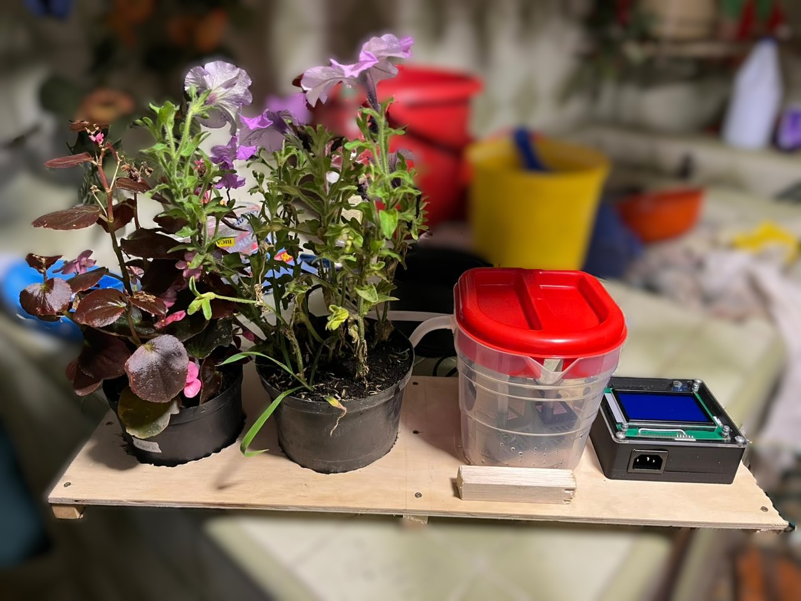
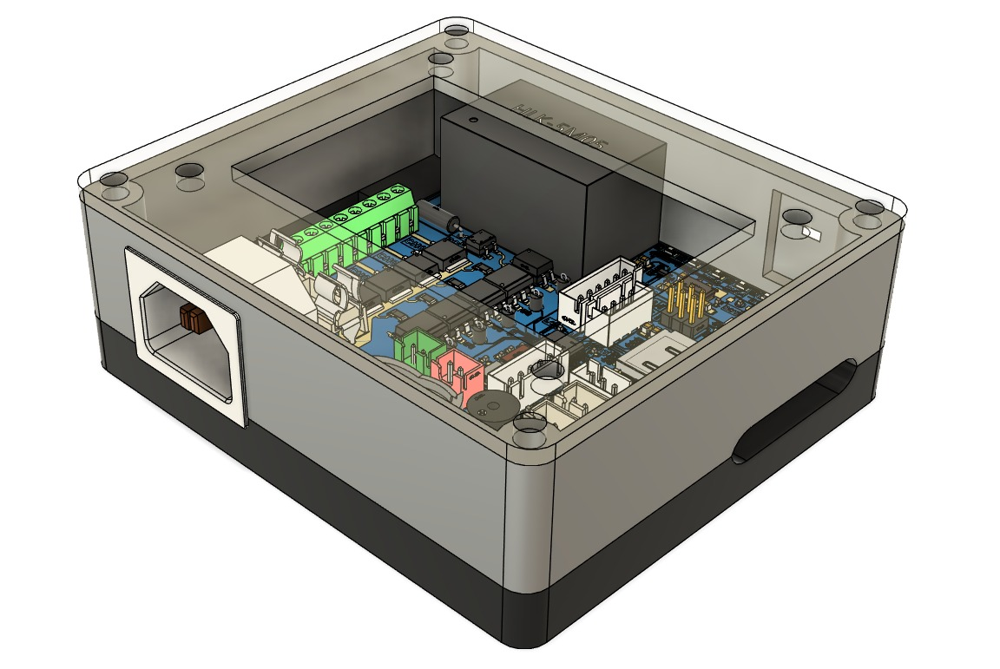
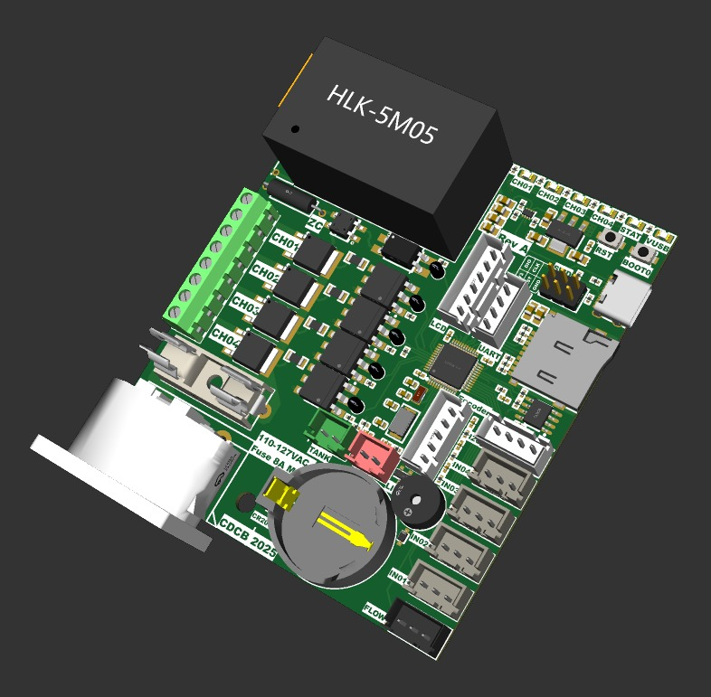

# STM32F103 Automatic Irrigation Controller

This project is an automatic 4 channel irrigation system based on a STM32F103C8T6 microcontroller. It monitors soil moisture each second and controls water flow to mantain the configured setpoint. It uses moisture, light and time to control the outputs.

## Features
- Integrated AC-DC power supply
- Supports power over AC and USB, with automatic changeover
- 4 independent channels (triac output, AC only), ON/OFF and power regulation
- Rotary encoder based user interface on a 128x64 monochromatic graphic LCD
- Highly configurable per-channel parameters, including power, hysteresys, sensor thresolds, among others
- Data logging on MicroSD card (SPI protocol). Library from ControllersTech: https://controllerstech.com/interface-sd-card-with-stm32-via-spi-dma/
- I2C Light sensor
- CR2032 coin battery holder for internal RTC

## Hardware
- STM32F103C8T6 MCU at 72MHz
- Analog soil moisture sensor inputs (0-3.3V)
- AC water pump / solenoid valve outputs (1A max per channel)
- 4 layer PCB

## Software
- Project created with STM32CubeIDE 1.19.0 using C and HAL
- Basic state machine for system behavior
- U8G2 library modified to support DMA transfers via SPI
## Future improvements
- USB based logging. Current code doesn't leave enough RAM for ST USB Device library to function properly.
- UART logging via the onboard connector
- Change SWD port from 2x6 pin header to ARM MIPI-10 or STDC 14 for easier debugger connection.
- Change current MCU to a modern STM32 series, as it doesn't support SDIO/SDMMC, has an old RTC that doesn't offer native date data and has the tendency to not be detected by debuggers.
